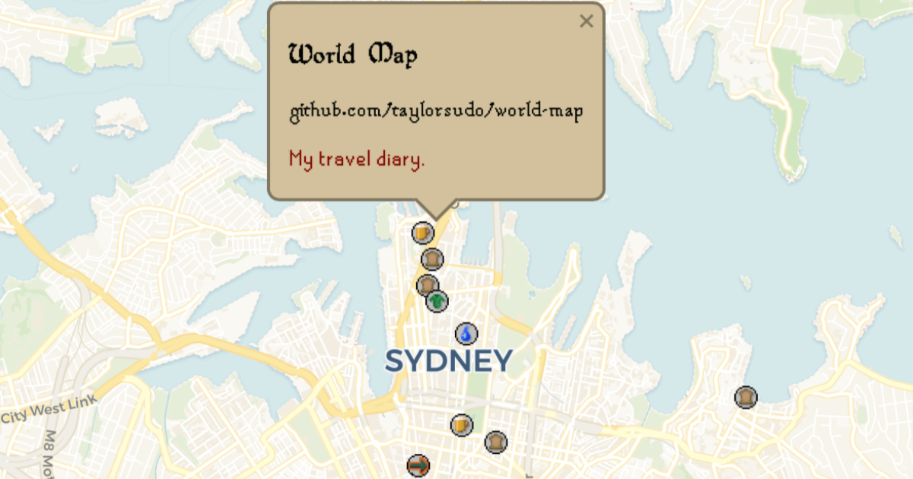

# World Map

Leaflet map that pulls locations from a Notion database (or manual entries) and displays them with RuneScape icons.



## Features
- Locations pulled from Notion database with `Category`, `Address`, `Latitude`, and `Longitude` properties
- Optional manual `customPlaces` list for quick overrides
- Lightweight Bun server for local use, plus Vercel-ready API routes
- Simple HTML/ESM frontend (Leaflet 2.0 alpha)
- Marker click shows popup with address and Notion page content
- Uses Old School RuneScape fonts (stolen from [RuneStar's fonts repo](https://github.com/RuneStar/fonts))

## Quick Setup
1) Install dependencies: `bun install`
2) Copy env: `cp .env.example .env`
3) Add Notion credentials to `.env`:
```
NOTION_API_KEY=secret_your_integration_token
NOTION_DATABASE_ID=your_database_id
PORT=3000
```
4) Populate your Notion database (schema below) and share it with the integration
5) Start the server: `bun start` then open http://localhost:3000

## Notion Database Schema

<p align="center">
  <video controls src="https://github.com/user-attachments/assets/4b6c7621-8783-43b6-8603-643522e6b60d"></video>
</p>

**I automate this with Apple Maps using an Apple Shortcut, which I will add here soon.** In the meantime, create a table database with these properties:
| Property | Type | Notes |
| --- | --- | --- |
| Name | Title | Place name |
| Category | Select | Icon key (must match an icon in `icons.js`, e.g., `Restaurant`, `Bank`) |
| Address | Rich text | Shown in the popup |
| Latitude | Number | Required |
| Longitude | Number | Required |

Add content blocks inside each page - this text will be shown in the popup when clicking markers.

Use the icon keys exactly as defined in `icons.js`. Unknown keys fall back to `Quest`.

## Config (`app.js`)
```js
const CONFIG = {
  mapCenter: [-33.8688, 151.2093],
  mapZoom: 11,
  customPlaces: [
    // { name: "Central Station", lat: -33.88, lng: 151.21, icon: "Transport" }
  ]
};
```

## Files
- `server.js` — Bun server; fetches Notion records and serves static files
- `api/notion/places.js` — Vercel serverless endpoint for fetching places
- `api/notion/page.js` — Vercel serverless endpoint for fetching page content
- `api/health.js` — Vercel health endpoint
- `placesService.js` — Frontend API client for Notion
- `app.js` — Map initialization and marker rendering with popup content
- `icons.js` — Icon definitions (RuneScape icons)
- `index.html` — Main HTML page with Leaflet map

## Deploying to Vercel
1. Push this repo and connect it in Vercel.
2. Add environment variables in the Vercel dashboard:
   - `NOTION_API_KEY`
   - `NOTION_DATABASE_ID`
3. Deploy. The frontend stays static, and `/api/notion/places` & `/api/notion/page` run via serverless functions.
